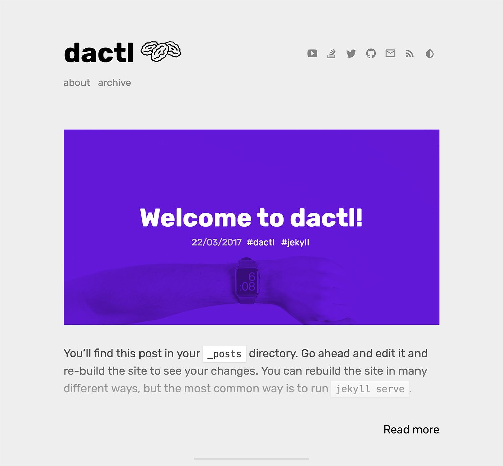
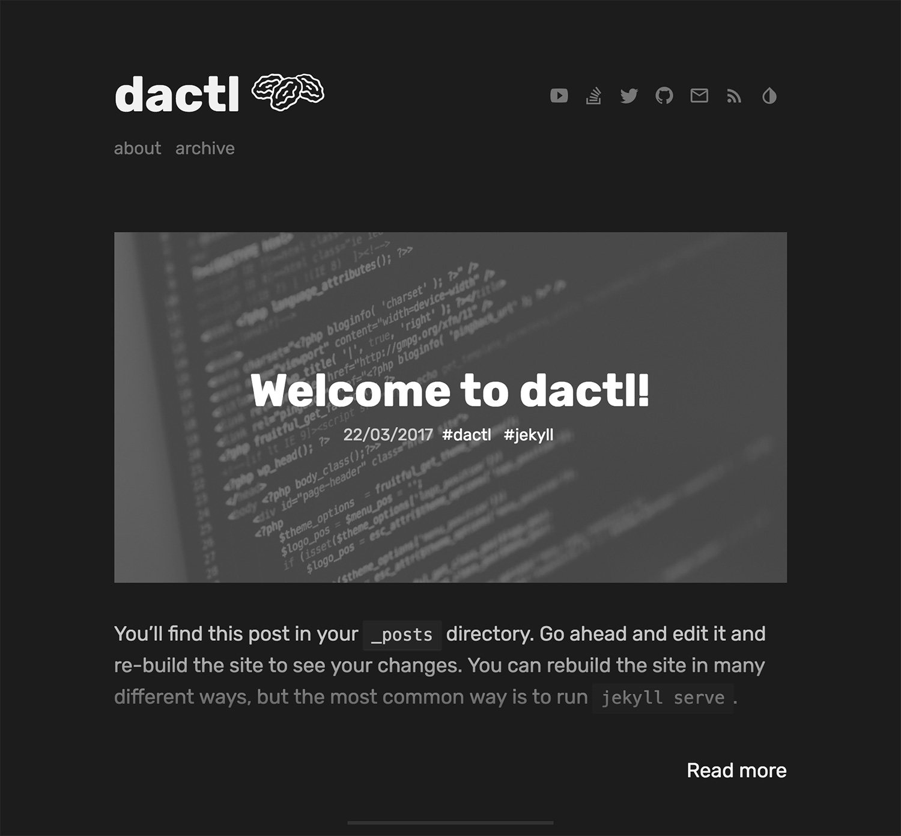

# dactl
dactl is a fast, modern and configurable [Jekyll](http://jekyllrb.com/) theme with some tricks up it's sleeve. It has a live theme switcher and it's main blog layout display prominent hero images for posts with colored overlays and nice animations.

## Features
Though minimalistic-looking by nature, dactl is easily configurable and includes quite a lot of niceties:

Main features:
* Customizable blog layout - choose how your posts will be displayed
* Light/Dark live theme switcher
* Inline footnotes using [Barefoot](https://github.com/philgruneich/barefoot)
* [IcoMoon](https://icomoon.io/) custom icon set (~4kb)
* Typography and components size set in `rem` and `em` which makes them easily scalable
* Responsive design

Jekyll-specific features:
* Pagination (default: 5 posts per page)
* Fully compatible with Jekyll 3.x and GitHub Pages
* SEO optimized
* [Google Analytics](https://www.google.com/analytics/) support
* [Disqus](https://disqus.com/) comments support
* Syntax highlighter using [Rouge](https://github.com/jneen/rouge) with numbered code lines

Other features:
* Archive page
* About page
* Tags functionality and tags pages
* Link posts functionality

Some of the features listed above can be easily configured or disabled by you.

## Information about dactl
At it's core, dactl is a forked version of [daktilo](https://github.com/kronik3r/daktilo) but it has been almost entirely rewritten from scratch.  
I have just started my journey in the world of web development, learning new things on the way.  
Looking for a way to put my newly acquired skills to test I found Jekyll and I quickly realized that it's going to be a good learning experience since I don't like building 'dummy' projects.  
I've built this theme as a way to develop my skills further.

You can find credits at the bottom of this Readme file.  
**All** feedback is welcome, both positive and negative.

## Installation
### Running locally
Assuming you've got Jekyll [installed](https://jekyllrb.com/docs/installation/), clone or download this repo, `cd` to wherever you've put `dactl` folder and run `jekyll -s'`

### Hosting on GitHub
Fork this repo and rename it to `yourusername.github.io`... and that's it!  
Your new dactl-themed Jekyll blog should be up and running at yourusername.github.io.  

## Usage
### Slight warning
dactl relies heavily on modern CSS properties such as [mix-blend-mode](http://www.w3.org/TR/compositing-1/#mix-blend-mode), [-webkit-filter](http://www.w3.org/TR/filter-effects-1/) and [css variables](https://drafts.csswg.org/css-variables/) so it may not work properly on older browsers.  
It was tested with and works fully on webkit-powered browsers - Safari, Chrome, Vivaldi.

### Layout configurations
By default dactl uses blog layout which you can see below or check for yourself in the live version.

Main blog layout displays 5 posts. Each post has a heading contained in a medium-sized tile - with an color overlay over the background image. You need to set the image and color of the overlay in post's YAML front matter.

If you don't want to use images for post headings you can easily configure the layout to you needs by changing settings located in `configure.yml` file, both post and blog layout will adapt accordingly.

Options include:
* Use or don't use post heading images (Blog & Post)
* Show full post content or post excerpts (Blog)
* Show post titles only (Blog)

## Additional information about some features
### Hero images and blog layout
Liquid 'script' which is used to append correct hero image and overlay color as set in post YAML Front matter was written by me and while it's really basic it functions properly.  
You can read more about it and see the code in `include/utils/hero.html`.

### Theme switcher
Theme switcher is made in vanilla Javascript and works using [CSS Variables](https://developer.mozilla.org/en-US/docs/Web/CSS/Using_CSS_variables). Values (colors) specified for each variable are injected into `:root` on every page load.  
User theme choice is saved in browser's [Local Storage](https://www.w3schools.com/html/html5_webstorage.asp) and is persistent through sessions.

You can edit the colors of both Light and Dark themes in `themeswitcher.js` file found in `_assets/js/`.

### Inline Barefoot footnotes
dactl uses [Barefoot](https://github.com/philgruneich/barefoot) plugin to create nice looking inline footnotes from those generated by [kramdown](https://kramdown.gettalong.org/), daktl's markdown processor.

Barefoot description (from project's page):
>[Barefoot](https://github.com/philgruneich/barefoot) is a lightweight [Bigfoot.js](https://github.com/lemonmade/bigfoot) alternative written in vanilla Javascript to create beautiful inline footnotes.  
Barefoot grabs the common markup used for footnotes on the web, mostly generated by Markdown processors, and transform it into beautiful and meaningful footnotes.

### CSS
CSS is built by via Jekyll's SASS compiler. Source partial SASS files are located in `_sass` folder, included into `main.scss`, and compile to `main.css`.

### Additional pages
#### Archive page
Archive page displays all of your posts grouped by month. Under this page's title you'll find a Searchbox which is hooked up to DuckDuckGo's `:site` search and will open the results in a new tab.  
You need to provide your blog's web address in `search_path` field found in `_config.yml` for it to work.
#### About page
About page displays your photo under the title (set in `config.yml`) and the content of about.md.
#### Tags & Tags Pages
Tags and tag pages are supported by using Jekyll's native collections functionality.  

## Even more info
### Rems, font-size and scaling
dactl is built almost entirely with `rem`s (instead of pixels). `rem`s are like `em`s, but instead of building on the immediate parent's font-size, they build on the root element, `<html>`.

By default, dactl uses the following:
~~~
html {
  font-size: 20px;
  line-height: 1.6;
}
@media (max-width: 48rem) {
  html {
    font-size: 18px;
  }
}
~~~
To easily scale your site's typography and components, simply customize the base font-sizes found in `_sass/variables.scss` file.

(Lifted from [here](https://github.com/poole/poole#rems-font-size-and-scaling))

## Credits
### Resources used
- [IcoMoon.io](https://icomoon.io/)
- [Normalize.css](https://github.com/necolas/normalize.css) - Nicolas Gallagher
- [Theme switcher](https://www.fdp.io/blog/2016/11/08/theming-via-css-properties/) - Fernando Paredes
- [Barefoot](https://github.com/philgruneich/barefoot) - Philip Gruneich
- [The Noun Project](https://thenounproject.com/) - Icon used as dactl's logo - [Artem Kovyazin](https://thenounproject.com/term/raisin/446158), icon used as 'avatar' in About [Drishya](https://thenounproject.com/term/profile/963272)

### Inspiration and thoughtful code-jacking
Inspiration and bits of things listed below are present inside dactl's code:
- [Daktilo](https://github.com/kronik3r/daktilo) - dactl is based on Daktilo and inherits it's one-column layout.
- [Hydejack](https://github.com/qwtel/hydejack/) - I've learned a lot about Jekyll when I took apart [@qwtel](https://github.com/qwtel/)'s excellent fork of [Hyde](https://github.com/poole/hyde) theme. I embraced his more partials = everything is easier to edit policy. Hydejack theme gave me an idea on how to create hero images liquid scripting, loading google fonts and using rem's/em's and more.
- [Minimal Mistakes](https://github.com/mmistakes/minimal-mistakes) - This guy makes awesome themes and writes a lot about Jekyll and it's more obscure use cases on his blog, [Made Mistakes](https://mademistakes.com). Looking through his theme's code - Minimal Mistakes in particular - gave me lot of information about how to build a robust theme and how to make it configurable within `_config.yml`
- [Trophy](https://github.com/thomasvaeth/trophy-jekyll) - Link border slide animation SASS mixin which I slightly modified to be able to easily change the direction of the animation.
- Various blog posts about Jekyll and [Stackoverflow](https://www.stackoverflow.com) posts with useful [Liquid](https://github.com/Shopify/liquid) snippets.

## License
All parts of dactl Jekyll theme are free to use and abuse under the open-source [MIT license](http://opensource.org/licenses/mit-license.php).

## TO DO
- [ ] Inline critical `.css` in `<head>` for faster load times
- [ ] Fix theme-switcher - sometimes it does not inject all of the colors properly on first page load and a refresh, fixes itself after switching the theme back and forth.
